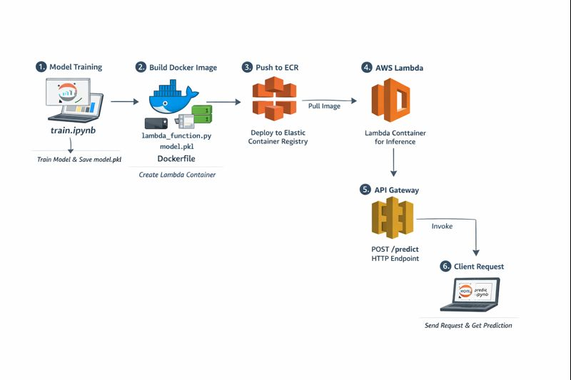
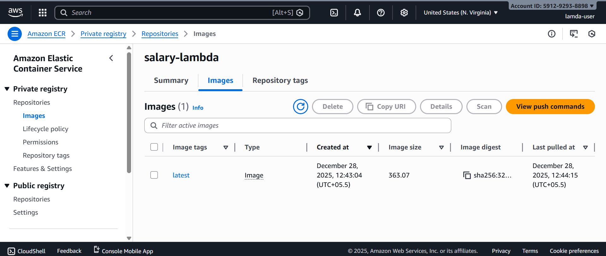
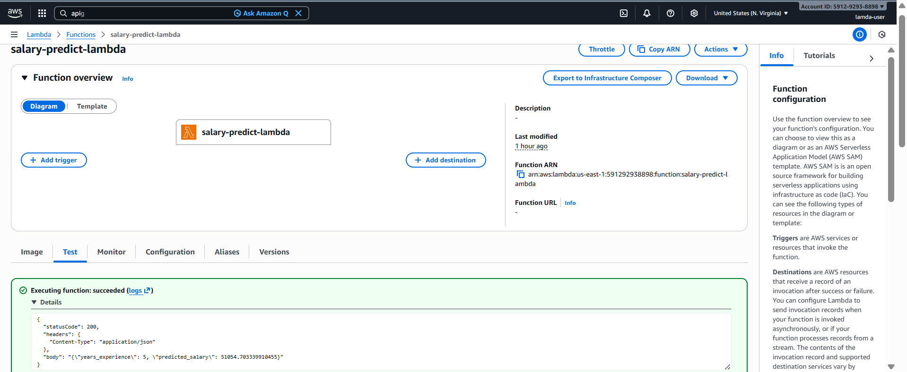
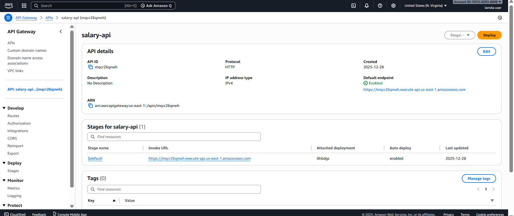

# 🚀 Serverless Salary Prediction using AWS Lambda (Container Image)

This project demonstrates a **complete real-world Machine Learning deployment** using **AWS Lambda with container images** and **API Gateway**.

A Linear Regression model is trained locally, serialized, packaged inside a Lambda-compatible Docker image, deployed to AWS, and exposed as a public HTTP API for real-time salary prediction.

This repository focuses on **practical deployment challenges**, **AWS-specific issues**, and **production-ready solutions**.

---

## 📌 Project Description

The goal of this project is to:
- Train a machine learning model locally
- Deploy the model without managing servers
- Use AWS Lambda for inference
- Expose the model via API Gateway
- Consume the API from external clients

The model predicts **salary based on years of experience** using **Linear Regression**.

---

## 🧠 Technologies Used

- Python 3.10
- NumPy
- scikit-learn
- joblib
- Docker
- AWS Lambda (Container Image)
- Amazon ECR
- API Gateway (HTTP API)
- AWS CLI

---

## 🧱 High-Level Architecture

The following diagram represents the deployed architecture:



**Explanation:**
- The trained ML model is packaged inside a Docker image
- Docker image is stored in Amazon ECR
- AWS Lambda runs the container image
- API Gateway exposes a `/predict` endpoint
- Clients send HTTP requests to get predictions

---

--------------------------------------------------------------------------------------------------------------------------------------------------------------

### 🐳 Build Lambda-Compatible Docker Image

Build the Docker image using the Lambda base image.
```powershell
docker build -t salary-lambda .
```

### 🧪 Test Lambda Locally (MANDATORY)

Run the Lambda container locally:

```powershell
docker run -p 9000:8080 salary-lambda
```

### Invoke the Lambda Runtime API:

```powershell
Invoke-RestMethod `
  -Uri http://localhost:9000/2015-03-31/functions/function/invocations `
  -Method POST `
  -ContentType "application/json" `
  -Body '{"years_experience": 3}'
```

Expected response:
```powershell
{
  "statusCode": 200,
  "body": "{\"years_experience\":3,\"predicted_salary\":48000.12}"
}
```

❗ Do NOT proceed to AWS until this works.

### 🔐 Configure AWS CLI Authentication

Configure AWS CLI with the correct IAM user.

```powershell
aws configure --profile lamda-user
```

Enter:
```powershell
Access Key: from lamda-user

Secret Key: from lamda-user

Region: us-east-1

Output format: json
```
Verify:
```powershell
aws sts get-caller-identity --profile lamda-user
```

Expected:
```powershell
"Arn": "arn:aws:iam::<ACCOUNT_ID>:user/lamda-user"
```

Set as default profile:
```powershell
aws configure
```

Confirm:
```powershell
aws sts get-caller-identity
```

### 📦 Login Docker to Amazon ECR

Authenticate Docker with Amazon ECR.
```powershell
aws ecr get-login-password --region us-east-1 `
| docker login --username AWS --password-stdin <ACCOUNT_ID>.dkr.ecr.us-east-1.amazonaws.com
```

Expected output:
Login Succeeded

### 🏷 Tag Docker Image
```powershell
docker tag salary-lambda:latest `
<ACCOUNT_ID>.dkr.ecr.us-east-1.amazonaws.com/salary-lambda:latest
```

### 🚀 Push Docker Image to ECR
```powershell
docker push <ACCOUNT_ID>.dkr.ecr.us-east-1.amazonaws.com/salary-lambda:latest
```

### 🛠 Fix OCI Image Index Issue (CRITICAL)

AWS Lambda does NOT support OCI image indexes.

Disable Docker BuildKit (PowerShell):
```powershell
$env:DOCKER_BUILDKIT=0
```

Verify:
```powershell
echo $env:DOCKER_BUILDKIT
```

Expected:
0


Clean old images:
```powershell
docker rmi salary-lambda:latest -f
docker system prune -f
```

Rebuild using classic Docker builder:
```powershell
docker build -t salary-lambda .
```

Verify architecture:
```powershell
docker image inspect salary-lambda:latest
```

Expected:
```powershell
"Architecture": "amd64",
"Os": "linux"
```

Re-tag and push the image again.

### 📸 Amazon ECR Screenshot


This confirms:
- Image is stored in ECR
- Correct architecture (amd64)
- No OCI image index

### ☁️ Create AWS Lambda Function

- Open AWS Console → Lambda
- Create function
- Select Container Image
- Function name: salary-predict-lambda
- Image source: ECR → salary-lambda:latest
- Architecture: x86_64
---> Configure:
Memory: 1024 MB
Timeout: 10 seconds

### 📸 AWS Lambda Screenshot


- This confirms:
- Lambda is using container image
- Function is active
- Proper resource configuration

### 🧪 Test Lambda in AWS Console

Test event:
```powershell
{
  "years_experience": 5
}
```

Expected response:
```powershell
{
  "statusCode": 200,
  "body": "{\"years_experience\":5,\"predicted_salary\":...}"
}
```

### 🌐 Create API Gateway (HTTP API)

- Open API Gateway
- Create HTTP API
- Integration: Lambda

- Route:
> Method: POST
> Path: /predict
> Stage: $default

- Auto-deploy: Enabled
- Enable CORS:
  - Methods: POST
  - Headers: Content-Type
  - Origins: *
- Invoke URL example:
- https://xxxxxxxx.execute-api.us-east-1.amazonaws.com

### 📸 API Gateway Screenshot


This confirms:
- API Gateway is connected to Lambda
- /predict route is active
- Public endpoint is available

### 🔗 Test Live API (PowerShell)
```powershell
Invoke-RestMethod `
  -Uri https://xxxxxxxx.execute-api.us-east-1.amazonaws.com/predict `
  -Method POST `
  -ContentType "application/json" `
  -Body '{"years_experience": 3.5}'
```

Expected response:
```powershell
{
  "years_experience": 3.5,
  "predicted_salary": 52000.12
}
```

🧠 Key Learnings

- AWS Lambda requires Docker v2 images
- OCI image indexes are rejected
- Classic Docker builder is mandatory on Windows
- API Gateway wraps request payload inside event["body"]
- $default stage auto-deploys APIs
- Serverless ML is scalable and cost-efficient

🏁 Final Outcome

- ✔ End-to-end ML deployment
- ✔ Fully serverless architecture
- ✔ No server management
- ✔ Auto-scaling inference API
- ✔ Production-ready AWS solution

This project demonstrates real-world ML deployment on AWS using Lambda container images.

